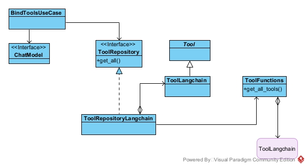
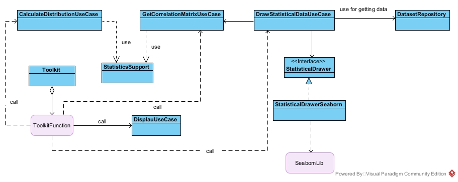

# LLM and Fairness
 

## Introduzione
Scopo di questo progetto è quello di provare ad automatizzare, con l'ausilio di un LLM (large language model), alcuni dei passi compiuti da un data scientist nel processo di analisi di un insieme di dati.
Quando si opera nel campo delle scienze sociali, una delle prime cose che un analista cerca di capire, è se l'insieme di dati di cui dispone mostra dei difetti, delle distorsioni che possano portare
a fenomeni di bias edd unfaireness nelle fasi successive del processo di analisi.
Questa prima fase di ricerca viene svolta, di norma, manualmente e richiede:
* la capacità, di natura tecnica, del saper gestire, manipolare i dati presenti in un dataset
* la conoscenza del contesto applicativo per capire come selezionare le caratteristiche e le variabili target (ad es. se si operasse nel campo bancario l'analista dovrebbe conoscere i concetti e 
  processi utilizzati dalle persone che operano in tale campo come mutuo, reddito ecc..... se volesse definire un modello che consenta di decidere se assegnare o meno un mutuo ad un determinato soggetto) 
* un po' di buonsenso (comunque soggettivo).
Ogni problema da risolvere è inquadrabile in uno specifico contesto. La questione del contesto è importante perché alcuni attributi possono essere considerati biased in certi contesti e non biased
in altri rendendo difficoltoso il processo di automatione del processo di analisi: una macchina così com'è, non è in grado di capire questa cosa.
L'utilizzo di un LLM addestrato consente, in qualche modo, di affrontare questa questione del contesto e fornire supporto all'automazione del processo di analisi.

Quelli che seguono sono alcuni passi eseguiti da un data scientist durante l'analisi di un dataset:
* Individuazione delle caratteristiche sensibili relativamente al contesto
  * una caratteristica è detta sensibile quando è potenzialmente fonte di unfairenss, disparità (come ad es. l'etnia, l'orientamento sessuale, informazioni sanitarie.....)
* caratteristiche non presenti nel dataset ma che ci si aspetterebbe di trovare nello specifico conteste applicativo
* valori non considerati nelle caratteristiche presenti
  * come ad esempio il genere non binario per la caratteristica 'genere'
* identificazione di caratteristiche proxy, nicchie e disproporzioni presenti nei dati di cui si dispone
  * (**spiegare cosa si intende per proxy, nicchia e disproporzione e perché è importante la loro identificazione**)
* identificare la caratteristica target
  * cioè la caratteristica sulla quale il modello dovrà fare una previsione usando come input le altre caratteristiche del dataset
* individuare il modello di problema di learning più 'appropriato' per il problema in esame
  * capire se è più 'consono' trattare il problema come problema di classificazione o regressione o clustering o ranking .....
L'obiettivo principale del progetto è quello di riuscire ad automatizzare, attraverso il supporto di un LLM, almeno i punti descritti precedentemente.

## Tecnologie
***In questa sezione il tirocinante elenca e commenta brevemente le
tecnologie utilizzate (linguaggi, piattaforme, sistemi operativi, ecc.)***
Nello sviluppo del progetto software sono state utilizzate diverse tecnologie.
### Linguaggio di programmazione Python
Il codice è stato realizzato interamente in linguaggio python. Si tratta di un liguaggio interpretato e di tipo dinamico (non è necessario dichiarare il tipo delle variabili come in js)
E' uno dei linguaggi più utilizzati nel campo dell'inteligenza artificiale poiché supportato da un'ampia gamma di librerie e framework
### Libreria Pandas
Per la parte legata alla manipolazione e gestione dei dati è stata utiilzzata la libreria Pandas. Questa fornisce strutture dati adatte a modellare insiemi di dati ed operazioni 
per la loro manipolazione e selezione.
### Framework LangChain
LancgChain è un framework che fornisce supporto allo sviluppo di applicazioni che fanno uso di LLM (large language model). Fornisce un'iterfaccia uniforme verso le diverse api fornite dai
diversi vendor è produttori di LLM. Implementa omogeneità al di sopra dell'eterogeità derivante dalle diverse api
### Libreria Scikit-learn
Scikit-learn è una libreria python di supporto allo sviluppo di applicazioni che utilizzano il machine learning.
### Libreria Seaborn
Seaborn è una libreria python che fornisce funzioni per la visualizzazione di dati statistici come istogrammi, heatmap, diagrammi di dispersione.......
### Jupyter Lab

## Attività
***Questa sezione, eventualmente frazionata in sottosezioni, è quella
centrale e più corposa dell’elaborato e deve illustrare (dal punto di vista tecnico, non
necessariamente cronologico) le attività svolte durante il tirocinio. A eccezione di
eventuali esempi, non deve includere il codice sviluppato; per descrivere algoritmi si
usino piuttosto pseudo-codice e/o diagrammi di vario tipo. Per lavori di tipo progettuale
è utile includere una sintetica documentazione formale di progetto***
#### Requisiti del software
Scopo del progetto software è quello di cercare di automatizzare il più possibile certe azioni che un data scientist esegue durante il processo di analisi di un dataset.  
Alcune di queste azioni sono state descritte nella sezione [Introduzione](#introduzione) di questo documento:
* Indentificazione delle caratteristiche sensibili relativamente al contesto
  * una caratteristica è detta sensibile quando è potenzialmente fonte di unfairenss, disparità (come ad es. l'etnia, l'orientamento sessuale, informazioni sanitarie.....)
* identificazione di caratteristiche non presenti nel dataset ma che ci si aspetterebbe di trovare nello specifico contesto applicativo
* identificazione di valori non considerati nelle caratteristiche presenti
  * come ad esempio il genere non binario per la caratteristica 'genere'
* identificazione di caratteristiche proxy, nicchie e disproporzioni presenti nei dati di cui si dispone
* identificazione della caratteristica target
  * cioè la caratteristica sulla quale il modello dovrà fare una previsione usando come input le altre caratteristiche del dataset
* identificazione del modello di problema di learning più 'appropriato' per il problema in esame
  * capire se è più 'consono' trattare il problema come problema di classificazione o regressione o clustering o ranking .....

Si richiede che il software da sviluppare, per poter soddisfare tali requisiti, faccia uso di un LLM come supporto all'attività di analisi  
#### Analisi dei requisiti
L'artefatto software deve:  
* inviare richieste ad un LLM
* ricevere ed elaborare risposte ricevute da un LLM
* visualizzare le richieste inoltrare all'LLM e le risposte ricevute
* calcolare alcune metriche statistiche relative alle caratteristiche
* visualizzare le metriche statistiche attraverso grafici
* caricare un dataset
* effettuare operazioni di data cleaning sul dataset
* trasformare il dataset in forma numerica per l'addestramento di modelli di ML
* fornire informazioni relative ad eventuali sbilanciamenti presenti nei dati
* fornire informazioni relative a valori non non considerati nelle caratteristiche
* fornire informazioni relative a caratteristiche non presenti nel dataset ma che potrebbero essere importanti nello specifico contesto
* fornire informazioni in merito alla presenza di caratteristiche proxy
* fornire informazioni su quale potrebbe essere la caratteristica target in relazione al contesto
* fornire informazioni relative alla tipologia di problema di learning più adatta alla risoluzione del problema (classificazione, regressione ....)
* fornire informazioni relative al modello di machine learning più appropriato in relazione ai risultati di performance ottenuti testando alcuni modelli disponibili
* preparare il dataset suddividendolo in un insieme per il testing e un insieme per il training di un modello
* addestramento del modello più appropriato e relativa previsione del target
* fornire informazioni relative alla analisi delle prestazioni del modello
* (valutazione della fairness relativamente alle decisioni prese da un modello(se ho tempo sarebbe bello))

#### Analisi del problema
L'applicazione invia ad un LLM una sequenza di messaggi predeterminati e definiti dall'utente. I messaggi sono memorizzati 
all'interno di una base dati. Essi vengono inviati all'LLM una alla volta seguendo un'interazione di tipo request-response 
sincrona. Successivamente all'invio di un messaggio l'LLM può rispondere con un semplice messaggio testuale il quale verrà 
semplicemente visualizzato all'utente attraverso un dispositivo di output oppure può rispondere attraverso un messaggio 
che richiede l'esecuzione di un tool. In quest'ultimo caso il messaggio contiene i parametri da passare al tool che deve 
essere eseguito. Il tool viene eseguito localmente ma i parametri vengono generati dall'LLM in base al messaggio di 
richiesta che esso ha ricevuto. L'esecuzione di un tool porta ad un risultato parte del quale viene usato per arricchire la 
memoria dell'LLM. Infatti sorge il problema della memoria che può essere risolto passando, ad ogni richiesta fatta all'LLM,  
tutti i messaggi inviati e ricevuti fino a quel momento. L'esecuzione di un tool porterà all'innesco di una specifica logica applicativa.  
La descrizione a parole di cui sopra può essere espressa anche attraverso un disegno che mostra l'architettura generale del sistema software  

   

##### Modelli dell'LLM e dei messaggi - problema dell'invio e della ricezione dei messaggi da e verso un LLM
L'LLM è stato modellato attraverso l'interfaccia ChatModel. Un ChatModel consente di inviare messaggi ad un LLM e ricevere risposte   
da un LLM. Il messaggio utente è stato modellato come UserMessage mentre i messaggi di risposta sono stati modellati come ChatMessage.

##### Elaborazione delle risposte ricevute dall'LLM (ChatModel)
Il ChatModel risponde ad una richiesta attraverso un ChatMessage. Questo può essere un semplice messaggio testuale che non richiede
alcuna elaborazione oppure può contere delle ToolCalls. L'interfaccia ToolCall modella una chiamata ad un tool richiesta dall'LLM
in risposta ad una richiesta. In tal caso il messaggio di risposta deve essere elaborato al fine di invocare il tool (oppure i tools) 
richiesto e restituirne il risultato. La gestione dell'elaborazione può essere affidata ad un ResponseHandlerUseCase. Tale interfaccia 
contiene il metodo handle il quale prende in ingresso un messaggio di risposta ottenuto da un ChatModel (ChatMessage) e restituisce:
* il messaggio ChatMessage nel caso in cui non dovesse essere invocato alcun tool
* il messaggio ToolExecutionMessage nel caso in cui fosse necessario invocare tools e restituirne i risultati

##### Problema della visualizzazione delle richieste e delle risposte ricevute
Tutte le richieste inoltrate all'LLM e le risposte da esso ricevute devono essere mostrate all'utente. La visualizzzione
potrebbe avvenire attraverso un qualunque dispositivo di output. Il problema è stato affrontato introducendo l'interfaccia
OutputDevice che mette a disposizione alcuni metodi per la visualizzazione di informazioni testuali e disegni

##### Problema del calcolo delle metriche statistiche e della loro visualizzazione tramite grafici
Le metriche statistiche sono moltissime ed esistono formule precise per il loro calcolo provenienti dal campo della
statistica. Quindi è stata introdotta l'interfaccia StatisticsSupport che fornisce alcune funzioni che si occupano 
del calcolo di alcune statistiche rilevanti per la nostra applicazione. Prima di poter visualizzare un grafico,
è necessario costruirlo. Il problema della costruzione dei grafici è stato affrontato introducendo l'interfacccia
StatisticalDrawer che mette a disposizione metodi per costruire alcuni grafici tipici della statistica come
istogrammi e heatmap. Il problema della visualizzazione dei grafici è delegato sempre all'interfaccia OutputDevice

##### Problema del caricamento di un dataset
Un dataset è generalmente memorizzato all'interno di file secondo uno specifico formato. I formati più popolari sono
csv, json ed xml. I dati contenuti all'interno del file, per poter essere manipolati più facilmente, devono essere 
trasformati in rappresentazioni astratte interne (astratte nel senso che non dipendono dal formato logico usato per organizzare
i dati all'interno del file). Attraverso tale rappresentazione interna sarà poi possibile eseguire operazioni di ricerca e modifica
sui dati. Il problema del caricamento è stato affrontato introducendo l'interfaccia DatasetFactory. Va comunque rispettata una
convenzione. La factory si aspetta che il dataset sia memorizzato all'interno della cartella dataset/{nomeDataset}/{nomeDataset}.data
insieme ad un altro file json della forma {nomeDataset}columns.json. La factory restituisce una rappresentazione astratta
del dataset nella forma di un oggetto di interfaccia DataFrame. 

##### Problema del data cleaning del dataset
Alcuni dataset possono presentare problemi come mancanza di dati, righe duplicate, errori di battitura........
Prima di procedere oltre il dataset andrebbe quindi ripulito. L'interfaccia DataFrame permette operazioni che consentono
di gestire queste anomalie. Il problema è stato affrontato introducendo l'interfaccia DatasetCleaner che espone il metodo
clean_dataset() il quale restituisce una copia ripulita del dataset.

##### Problema della trasformazione di un dataset in forma numerica
La maggior parte dei modelli di machine learning supporta solo dati in forma numerica. Quindi si pone il problema della
codifica in forma numerica di tutte le variabili categoriche eventualmente presenti all'interno del dataset. Il problema
può essere affrontato introducendo l'interfaccia DatasetEncoder.

##### Problema del rilevamento di variabili proxy
Le variabili proxy potrebbero essere identificate usando 1) la mutua informazione fra ogni variabile del dataset e tutte le
altre 2) usando un modello che predica ogni variabile a partire da tutte le altre e che fornisca informazioni sulla rilevanza
di ogni variabile di input per la previsione della variabile considerata come target. Modelli di questo tipo sono Random Forest
e Gradient boosting 3) possiamo provare anche con una matrice di correlazione. Il problema è stato affrontato 
introducendo l'interfaccia ProxyDetector che restituisce informazioni sotto forma di ProxyDetection. Inoltre l'interfaccia
StatisticsSupport fornisce una operazione per calcolare la matrice di correlazione 

##### Problema della suddivisione del dataset in preparazione dell'addestramento di un modello e successiva previsione
Un modello di ML dovrebbe essere addestrato usando un certo insieme di dati. Successivamente all'addestramento, al modello
verrà chiesto di fare una previsione usando un insieme di dati (privato della variabile target) che il modella non abbia 
mai visto. Potremmo, ad esempio, suddividere l'insieme dati a disposizione in due parti (nel senso orizzontale) andando
così a creare un insieme di training e un insieme di test. Tale problema è stato affrontato introducendo l'interfaccia
DatasetTrainTestSplitter che fornisce il metodo split() e restituisce un oggetto di interfaccia Split che rappresenta
un insieme di 4 elementi: insieme X per il testing (il dataset meno la colonna della variabile target), 
insieme y per il testing (colonna variabile target), insieme X per il training e insieme y per il training

##### Problema della valutazione di un modello
La bontà di un modello può essere valutata usando diverse metriche quali accuratezza, precisione, recall, f1-score (dipendente 
da precisione e recall). L'importanza della metrica dipende dal problema. Inoltre un modello potrebbe essere bravo nel 
predire dati già visti ma non altrettanto bravo con dati mai visti (non capace di generalizzare - overfitted). Un modo 
possibile di affrontare il problema è quello di utilizzare la tecnica della cross validation. E' stata introdotta l'interfaccia
CrossValidation che fornisce un metodo per cross validare un modello ed ottenere una valutazione delle metriche passate in ingresso

##### Problema dell'addestramento di un modello
Il problema dell'addestramento di un modello richiede la soluzione del 
* problema relativo alla codifica del dataset in forma numerica 
* problema relativo allo splitting del dataset negli insiemi di training e testing descritti precedentemente
* scelta del modello più appropriato alla soluzione del problema di learning.  
Si tratta di un problema di classificazione binaria ed è possibile scegliere fra diversi modelli più o meno complessi. 
Il problema è stato affrontato introducendo l'interfacccia classifier che mette a disposizione operazioni per
l'addestramento e per la previsione.

#### Progettazione della soluzione
E' stata introdotta la classe ApplLogic che governa la logica dell'applicazione (rappresenta il componente di controllo
dell'architettura generale del sistema). L'ApplLogic si appoggia sopra uno strato di use cases ciascuno dei quali realizza
qualche funzionalità (logica) specifica. Lo strato degli use cases si appoggia al di sopra di uno strato di dominio composto
da interfacce, modelli dati, interfacce di repository (astrazione di una base di dati). Sono stati definiti degli adapters
per agganciare la tecnologia al modello del dominio. Il modello architetturale è clean architecture like.

* Comunicazione con un LLM - invio richieste e ricezione risposte
  * Per ciò che concerne la comunicazione con un LLM fisico l'interfaccia ChatModel è stata implementata facendo uso del
  framework LangChain. In particolare si è fatto uso del modello gemini di google poiché offre un livello gratuito (sebbene 
  fortemente limitato). La classe astratta ChatModelLangChain usa internamente un metodo factory per delegare la creazione 
  di un supporto specifico alle sue sottoclassi. Consente di inviare un messaggio in forma di stringa ad un LLM specifico.
  Attende una risposta e crea un ChatMessageLangchain che rappresenta l'implementazione concreta basata su langchain dell'interfaccia
  ChatMessage. Il ChatMessageLangchain incapsula un AIMessage del framework Langchain (un adapter).
  

* Binding dei tool
  * Un LLM, perché sia in grado di invocare funzioni, necessita di un binding. Il binding è affidato al BindToolSUseCase.
  Questo chiede ad un ToolRepository tutti i tool disponibili e poi chiama il metodo bind_tools() su un oggetto che
  implementa l'interfaccia ChatModel. I tool langchain sono stati implementati come funzioni annotate con l'annotazione
  @tool di langchain ed inserite tutte all'interno del modulo tool_functions. L'interfaccia ToolRepository del dominio
  è stata realizzata dalla classe ToolRepositoryLangchain che altro non fa se non chiamare get_all_tools() del modulo 
  tool_functions per riempire il repository (una lista in memory)

* Elaborazione delle risposte ricevute
  * l'elaborazione delle risposte ricevute da un LLM viene affidata ad un HandleResponseUseCase. Se il messaggio di risposta
  ricevuto non contiene tool calls questo viene restituito al chimante così com'è senza ulteriori elaborazioni. Se invece fossero
  presenti delle calls nella risposta allora l'handler le manda tutte in esecuzione. Le calls sono rappresentate dalla classe
  ToolCall che incapsula il nome del tool da invocare e gli argomenti con i quali invocare il tool. Il tool è rappresentato
  dalla classe ToolLangchain che implementa la classe astratta di dominio Tool e ne implementa il metodo execute() che va
  creando un ToolExecutionMessageLangchain il quale incapsula il nome del tool invocato e il risultato dell'esecuzione del tool.
  

* Visualizzazione delle richieste, delle risposte e dei grafici
  * La visualizzazione è delegata ad un DisplayUseCase che esponse delle operazioni per la visualizzazione di richieste,
  rispose, figure (grafici), testo semplice e markdown. Internamente, DisplayUseCase fa uso di un OutputDevice. DisplayUseCase
  viene utilizzato sia all'interno dell'ApplLogic sia all'interno dei tool di basso livello langchain

* Calcolo metriche statistiche e disegno dei grafici
  * La funzionalità è stata realizzata per mezzo di CalculateDistributionUseCase, GetCorrelationMatrixUseCase e
  DrawStatisticalDataUseCase. I 3 casi di uso vengono invocati dal tool langchain di basso livello. CalculateDistributionUseCase
  e GetCorrelationMatrixUseCase fanno uso di un supporto StatisticsSupport per ottenere i valori delle statistiche.
  Il DrawStatisticalDataUseCase usa internamente uno StatisticalDrawer per costruire i grafici.

* Caricamento dataset
  * I dataset sono generalmente memorizzati all'interno di file (oppure potrebbero essere scaricati direttamente dalla rete).
  Del caricamento di un dataset se ne occupa un LoadDatasetUseCase. Internamente utilizza un DatasetFactory, che si occupa del
  caricamento del dataset ovvero della sua trasformazione in una struttura dati interna quale DataFrame, e un DatasetRepository
  che tiene memoria del dataset astratto caricato. Per convenzione, i dataset devono trovarsi all'interno di un file del tipo {nome_dataset}.data
  situato all'interno di una cartella avente nome {nome_dataset} a sua volta inserita all'interno della cartella datasets. Il DatasetFactory
  utilizza l'interfaccia DatasetLoader che si occupa del caricamento vero e proprio da file su disco(come da convenzione). Inoltre
  all'interno della cartella dove è presente il file .data deve essere presente un file {nome_dataset}columns.json che fornisca
  informazioni relative alle colonne del dataset. Questo per la gestione dell'intestazione del frame astratto poiché alcuni dataset vengono
  già forniti con le intestazioni altri invece no.

* Cleaning del dataset
  * L'attività di pulizia del dataset viene affidata ad un CleanDatasetUseCase. Internamente utilizza un DatasetRepository ed un 
  DatasetCleaner. Il DatasetCleaner utilizza il file preprocessingconfig.json che deve riportare il nome dgli step di cleaning da eseguire,
  il nome del dataset sul quale eseguire gli steps e l'elenco dei simboli da rimpiazzare con valori NaN. Usando il file di configurazione
  DatasetCleaner crea un DatasetPreprocessingConfig che viene passato ad un DatasetPreprocessingBuilder. Questi crea un DatasetPreprocessing
  ed usa una ProcessingStepFactory per creare i diversi Step (azioni) di pulizia (quelli indicati nel file di config). Il builder ritorna 
  al chiamante un oggetto di interfaccia DatasetPreprocessing che fornisce l'operazione preprocess_dataset() invocata da DatasetCleaner il quale,
  a sua volta viene invocato dal CleanDatasetUseCase (invocazione del moetodo clean_dataset())

  
* Encoding dataset
  * L'encoding è affidato ad un EncodeDatasetUseCase che internamente utilizza un DatasetRepository, per il recupero del dataset caricato
  in precendeza, un DatasetEncoder, che si occupa della codifica vera e propria e un DatasetInfo che contiene informazioni relative
  alle variabili del dataset quali il nome della variabile, il tipo (nominale, ordinale, numerica) e l'insieme dei possibili valori
  che la variabile può assumere (nel caso categorico). DatasetInfo prende queste informazioni a partire da un file che deve essere presente
  nella cartella relativa al dataset e con nome {nome_dataset}columnsencoding.json. Il DatasetEncoder lascia le variabili numeriche inalterate operando
  la codifica numerica delle sole variabili categoriche. Per ciascuna di essere, in base al tipo (ordinale o nominale) viene creata una mappa di encoder
  del tipo 'nome_attributo': nome, 'encoder': encoder attraverso una EncoderFactory che crea oggetti di interfaccia Encoder. Quindi procede ad
  invocare il metodo encode su ogni encoder della mappa. Viene restituito al chiamante (EncodeDatasetUseCase)il dataset codificato il
  quale viene salvato all'interno del DatasetRepository con il nome {dataset_name}_encoded.

* Identificazione delle variabili proxy
  * La soluzione che utilizza un modello per predire una variabile a partire da tutte le altre per poi verificare l'importanza di
  ciascuna variabile nella determinazione della previsione non è stata possibile nel mio pc data la mancanza di risorse computazionali (memoria insufficiente).
  Ho utilizzato la mutua informazione. L'identificazione è affidata al DetectProxyUseCase che internamente utilizza un DatasetRepository ed
  un ProxyDetector (che calcola la mutua informazione fra una variabile e tutte le altre presenti nel dataset). Il DetectProxyUseCase restituisce
  una lista di ProxyDetection (memorizza un dizionario del tipo {'nome_variabile': nome,'mutua_informazione': mi})

## Conclusioni
***In questa parte lo studente trae le conclusioni del lavoro svolto,
valutando pregi e difetti dell’esperienza e, più specificamente, riassumendo quanto
appreso.***

## Bibliografia
***Questa sezione, opzionale, include i riferimenti a manuali, testi e
articoli scientifici eventualmente consultati durante il lavoro, ordinati per cognome del
primo autore***
