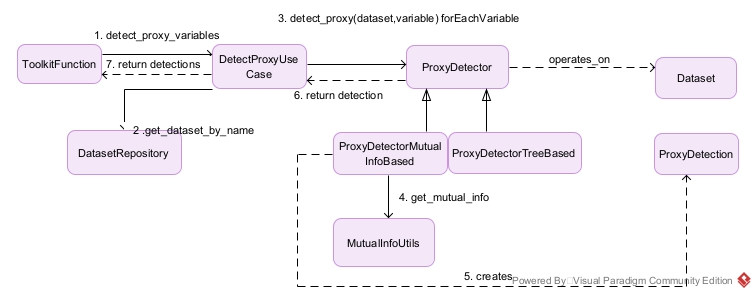
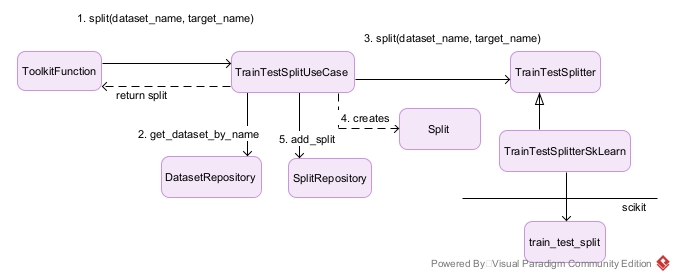

# LLM and Fairness
 

## Introduzione
Scopo di questo progetto è quello di provare ad automatizzare, con l'ausilio di un LLM (large language model), alcuni dei passi compiuti da un data scientist nel processo di analisi di un insieme di dati.
Quando si opera nel campo delle scienze sociali, una delle prime cose che un analista cerca di capire, è se l'insieme di dati di cui dispone mostra dei difetti, delle distorsioni che possano portare
a fenomeni di bias ed unfairness nelle fasi successive del processo di analisi.
Questa prima fase di ricerca viene svolta, di norma, manualmente e richiede:
* la capacità, di natura tecnica, del saper gestire, manipolare i dati presenti in un dataset
* la conoscenza del contesto applicativo per capire come selezionare le caratteristiche e le variabili target (ad es. se si operasse nel campo bancario l'analista dovrebbe conoscere i concetti e 
  processi utilizzati dalle persone che operano in tale campo come mutuo, reddito ecc..... se volesse definire un modello che consenta di decidere se assegnare o meno un mutuo ad un determinato soggetto) 
* un po' di buonsenso (comunque soggettivo).

Ogni problema da risolvere è inquadrabile in uno specifico contesto. La questione del contesto è importante perché alcuni attributi possono essere considerati biased in certi contesti e non biased
in altri rendendo difficoltosa l'automazione del processo di analisi: una macchina così com'è, non è in grado di capire questa cosa.
L'utilizzo di un LLM addestrato consente, in qualche modo, di affrontare questa questione del contesto e fornire supporto all'automazione del processo di analisi.

Quelli che seguono sono alcuni passi eseguiti da un data scientist durante l'analisi di un dataset:
* Individuazione delle caratteristiche sensibili relativamente al contesto
  * una caratteristica è detta sensibile quando è potenzialmente fonte di unfairness, disparità (come ad es. l'etnia, l'orientamento sessuale, informazioni sanitarie.....)
* caratteristiche non presenti nel dataset ma che ci si aspetterebbe di trovare nello specifico conteste applicativo
* valori non considerati nelle caratteristiche presenti
  * come ad esempio il genere non binario per la caratteristica 'genere'
* identificazione di caratteristiche proxy, di nicchie ed eventuali disproporzioni presenti nei dati di cui si dispone
  * una variabile proxy è una variabile strettamente correlata ad un'altra e che può essere sostituita ad essa (porta con se molta informazione  
    sull'altra variabile). I proxy possono portare a distorsioni nei dati ed avere un impatto significativo sulla decisione presa da un modello.
  * una nicchia può essere definita come un sottoinsieme di piccole dimensioni dei dati aventi caratteristiche simili. La loro minoranza nell'insieme
  può essere fonte di disparità, discriminazione
  * una disproporzione può essere definita come un mancato bilanciamento nei valori di una caratteristica (ad. esempio più femmine che maschi
  nella caratteristica 'genere'). Le disproporzioni possono favorire gruppi a danno di altri
  * l'identificazione di proxy, nicchie e disproporzioni nei dati è importante perché possono influenzare, distorcere la decisione presa da un modello e  
    portare a fenomeni di unfairness e situazioni di svantaggio per alcuni gruppi.
* identificare la caratteristica target
  * cioè la caratteristica sulla quale il modello dovrà fare una previsione usando come input le altre caratteristiche del dataset
* individuare il modello di problema di learning più 'appropriato' per il problema in esame
  * capire se è più 'consono' trattare il problema come problema di classificazione o regressione o clustering o ranking ..... in base al contesto applicativo

L'obiettivo principale del progetto è quello di riuscire ad automatizzare, attraverso il supporto di un LLM, almeno i punti descritti precedentemente.

## Tecnologie

Nello sviluppo del progetto software sono state utilizzate diverse tecnologie.
### Linguaggio di programmazione Python

Il codice è stato realizzato interamente in linguaggio python. Si tratta di un linguaggio interpretato e di tipo dinamico (non è necessario dichiarare il tipo delle variabili come in js)
E' uno dei linguaggi più utilizzati nel campo dell'intelligenza artificiale poiché supportato da un'ampia gamma di librerie e framework.

### Libreria Pandas
Per la parte legata alla manipolazione e gestione dei dati è stata utilizzata la libreria Pandas. Questa fornisce strutture dati adatte a modellare insiemi di dati ed operazioni 
per la loro manipolazione e selezione.

### Framework LangChain
LangChain è un framework che fornisce supporto allo sviluppo di applicazioni che fanno uso di LLM (large language model). Fornisce un'interfaccia uniforme verso le diverse api fornite dai
diversi vendor è produttori di LLM. Implementa omogeneità al di sopra dell'eterogeneità derivante dalle diverse api vendor-dependent.

### Libreria Scikit-learn
Scikit-learn è una libreria python di supporto allo sviluppo di applicazioni che utilizzano il machine learning.

### Libreria Seaborn
Seaborn è una libreria python che fornisce funzioni per la visualizzazione di dati statistici come istogrammi, heatmap, diagrammi di dispersione.......

### Libreria Fairlearn
Fairlearn è una libreria che fornisce supporto alla valutazione della fairness nella decisione presa da un modello. Mette a disposizione classi e  
funzioni per calcolare le principali metriche, per gruppi, usate per valutare la fairness di un modello (selection_rate, parità demografica...). Offre
anche funzionalità di mitigazione di eventuali distorsioni.

### Jupyter Lab
E' un ambiente web-based che consente di produrre documenti interattivi contenti codice, testo normale, grafici vari e controlli interattivi (come bottoni, slider....)
E' utile per prototyping, per spiegare codice, per visualizzare dati di varia natura e condividere informazioni con altri.

## Attività
Durante l'attività di tirocinio è stata sviluppata un'applicazione software per capire se fosse o meno possibile l'utilizzo di LLM
per automatizzare alcune delle fasi di un processo di analisi di un insieme di dati sfruttando la conoscenza ed il "buon senso" acquisiti da esso (LLM)
durante l'addestramento. 

#### Requisiti del software
Scopo del progetto software è quello di cercare di automatizzare il più possibile certe azioni che un data scientist esegue durante il processo di analisi di un dataset.  
Alcune di queste azioni sono state descritte nella sezione [Introduzione](#introduzione) di questo documento:
* Identificazione delle caratteristiche sensibili relativamente al contesto
  * una caratteristica è detta sensibile quando è potenzialmente fonte di unfairenss, disparità (come ad es. l'etnia, l'orientamento sessuale, informazioni sanitarie.....)
* identificazione di caratteristiche non presenti nel dataset ma che ci si aspetterebbe di trovare nello specifico contesto applicativo
* identificazione di valori non considerati nelle caratteristiche presenti
  * come ad esempio il genere non binario per la caratteristica 'genere'
* identificazione di caratteristiche proxy, nicchie e disproporzioni presenti nei dati di cui si dispone
* identificazione della caratteristica target
  * cioè la caratteristica sulla quale il modello dovrà fare una previsione usando come input le altre caratteristiche del dataset
* identificazione del modello di problema di learning più 'appropriato' per il problema in esame
  * capire se è più 'consono' trattare il problema come problema di classificazione o regressione o clustering o ranking .....

Si richiede che il software da sviluppare, per soddisfare tali requisiti, faccia uso di un LLM come supporto all'attività di analisi 

#### Analisi dei requisiti
L'artefatto software deve:  
* inviare richieste ad un LLM
* ricevere ed elaborare risposte ricevute da un LLM
* visualizzare le richieste inoltrate all'LLM e le risposte ricevute
* calcolare alcune metriche statistiche relative alle caratteristiche
* visualizzare le metriche statistiche attraverso grafici
* caricare un dataset
* effettuare operazioni di data cleaning sul dataset
* trasformare il dataset in forma numerica per l'addestramento di modelli di ML
* fornire informazioni relative ad eventuali sbilanciamenti presenti nei dati
* fornire informazioni relative a valori non considerati nelle caratteristiche
* fornire informazioni relative a caratteristiche non presenti nel dataset ma che potrebbero essere importanti nello specifico contesto
* fornire informazioni in merito alla presenza di caratteristiche proxy
* fornire informazioni su quale potrebbe essere la caratteristica target in relazione al contesto
* fornire informazioni relative alla tipologia di problema di learning più adatta alla risoluzione del problema (classificazione, regressione ....)
* fornire informazioni relative al modello di machine learning più appropriato in relazione ai risultati di performance ottenuti testando alcuni modelli disponibili
* preparare il dataset suddividendolo in un insieme per il testing e un insieme per il training di un modello
* addestramento del modello più appropriato e relativa previsione del target
* fornire informazioni relative all'analisi delle prestazioni del modello
* calcolo di alcune metriche di gruppo legate alla fairness della decisione presa dal modello
* fornire informazioni relative alla fairness delle decisioni prese da un modello

#### Analisi del problema
L'applicazione deve inviare ad un LLM una sequenza di messaggi predeterminati e definiti dall'utente. I messaggi sono memorizzati 
all'interno di una base dati. Essi vengono inviati all'LLM una alla volta seguendo un'interazione di tipo request-response 
sincrona. Successivamente all'invio di un messaggio l'LLM può rispondere con un semplice messaggio testuale il quale verrà 
semplicemente visualizzato all'utente attraverso un dispositivo di output oppure può rispondere attraverso un messaggio 
che richiede l'esecuzione di un tool specifico. In quest'ultimo caso il messaggio contiene il nome del tool che deve essere eseguito e i parametri da passare ad esso.  
Il tool viene eseguito localmente ma alcuni dei parametri vengono generati dall'LLM in base al messaggio di 
richiesta che esso ha ricevuto e in base alla cronologia delle interazioni (composta da tutti i messaggi da esso inviati e ricevuti precedentemente). 
L'esecuzione di un tool porta ad un risultato, parte del quale viene usato per arricchire la 
memoria dell'LLM. Infatti sorge il problema della memoria che può essere risolto tenendo traccia di tutte le interazioni e passando, ad ogni richiesta fatta all'LLM,  
tutti i messaggi inviati e ricevuti fino a quel momento. L'esecuzione di un tool porterà all'innesco di una specifica logica applicativa.  
La descrizione a parole di cui sopra può essere espressa anche attraverso un disegno che mostra l'architettura generale del sistema software  

   

##### Modelli dell'LLM e dei messaggi - problema dell'invio e della ricezione dei messaggi da e verso un LLM
L'LLM è stato modellato attraverso l'interfaccia ChatModel. Un ChatModel consente di inviare messaggi ad un LLM e ricevere risposte   
da un LLM. Il messaggio utente è stato modellato come UserMessage mentre i messaggi di risposta sono stati modellati come ChatMessage.

##### Elaborazione delle risposte ricevute dall'LLM (ChatModel)
Il ChatModel risponde ad una richiesta attraverso un ChatMessage. Questo può essere un semplice messaggio testuale che non richiede
alcuna elaborazione oppure può contenere delle ToolCalls. L'interfaccia ToolCall modella una chiamata ad un tool richiesta dall'LLM
in risposta ad una richiesta. In tal caso il messaggio di risposta deve essere elaborato al fine di invocare il tool (oppure i tools) 
richiesto e restituirne il risultato. La gestione dell'elaborazione può essere affidata ad un ResponseHandlerUseCase. Tale interfaccia 
contiene il metodo handle il quale prende in ingresso un messaggio di risposta ottenuto da un ChatModel (ChatMessage) e restituisce:
* il messaggio ChatMessage nel caso in cui non dovesse essere invocato alcun tool
* il messaggio ToolExecutionMessage nel caso in cui fosse necessario invocare tools e restituirne i risultati

##### Problema della memoria
Un LLM, di per se, non mantiene memoria dei messaggi ricevuti ed inviati in una conversazione con un utente. Ma affinché la
conversazione sia proficua è necessario che esso ricordi ciò che ha ricevuto e ciò che ha inviato. Il problema della memoria
è stato affrontato introducendo l'interfaccia MemoryRepository che offre metodi per aggiungere una memoria e recuperare la
cronologia delle memorie

##### Problema della visualizzazione delle richieste e delle risposte ricevute
Tutte le richieste inoltrate all'LLM e le risposte da esso ricevute devono essere mostrate all'utente. La visualizzazione
potrebbe avvenire attraverso un qualunque dispositivo di output. Il problema è stato affrontato introducendo l'interfaccia
OutputDevice che mette a disposizione alcuni metodi per la visualizzazione di informazioni testuali e disegni

##### Problema del calcolo delle metriche statistiche e della loro visualizzazione tramite grafici
Le metriche statistiche sono moltissime ed esistono formule precise per il loro calcolo provenienti dal campo della
statistica. Quindi è stata introdotta l'interfaccia StatisticsSupport che fornisce alcune funzioni che si occupano 
del calcolo di alcune statistiche rilevanti per la nostra applicazione. Prima di poter visualizzare un grafico,
è necessario costruirlo. Il problema della costruzione dei grafici è stato affrontato introducendo l'interfacccia
StatisticalDrawer che mette a disposizione metodi per costruire alcuni grafici tipici della statistica come
istogrammi e heatmap. Il problema della visualizzazione dei grafici è delegato sempre all'interfaccia OutputDevice

##### Problema del caricamento di un dataset
Un dataset è generalmente memorizzato all'interno di file secondo uno specifico formato. I formati più popolari sono
csv, json ed xml. I dati contenuti all'interno del file, per poter essere manipolati più facilmente, devono essere 
trasformati in rappresentazioni astratte interne (astratte nel senso che non dipendono dal formato logico usato per organizzare
i dati all'interno del file). Attraverso tale rappresentazione interna sarà poi possibile eseguire operazioni di ricerca e modifica
sui dati. Il problema del caricamento è stato affrontato introducendo l'interfaccia DatasetLoader. (**Va comunque rispettata una
convenzione. La factory si aspetta che il dataset sia memorizzato all'interno della cartella dataset/{nomeDataset}/{nomeDataset}.data
insieme ad un altro file json della forma {nomeDataset}columns.json. La factory restituisce una rappresentazione astratta
del dataset nella forma di un oggetto di interfaccia DataFrame**). 

##### Problema del data cleaning del dataset
Alcuni dataset possono presentare problemi come mancanza di dati, righe duplicate, errori di battitura........
Prima di procedere oltre il dataset andrebbe quindi ripulito. L'interfaccia DataFrame permette operazioni che consentono
di gestire queste anomalie. Il problema è stato affrontato introducendo l'interfaccia DatasetCleaner che espone il metodo
clean_dataset() il quale restituisce una copia ripulita del dataset.

##### Problema della trasformazione di un dataset in forma numerica
La maggior parte dei modelli di machine learning supporta solo dati in forma numerica. Quindi si pone il problema della
codifica in forma numerica di tutte le variabili categoriche eventualmente presenti all'interno del dataset. Il problema
può essere affrontato introducendo le interfacce DatasetEncoder ed Encoder.

##### Problema del rilevamento di variabili proxy
Le variabili proxy potrebbero essere identificate usando 1) la mutua informazione fra ogni variabile del dataset e tutte le
altre 2) usando un modello che predica ogni variabile a partire da tutte le altre e che fornisca informazioni sulla rilevanza
di ogni variabile di input per la previsione della variabile considerata come target. Modelli di questo tipo sono Random Forest
e Gradient boosting 3) possiamo provare anche con una matrice di correlazione. Il problema è stato affrontato 
introducendo l'interfaccia ProxyDetector che restituisce informazioni sotto forma di ProxyDetection. Inoltre l'interfaccia
StatisticsSupport fornisce una operazione per calcolare la matrice di correlazione 

##### Problema della suddivisione del dataset in preparazione dell'addestramento di un modello e successiva previsione
Un modello di ML dovrebbe essere addestrato usando un certo insieme di dati. Successivamente all'addestramento, al modello
verrà chiesto di fare una previsione usando un insieme di dati (privato della variabile target) che non abbia 
mai visto prima. Potremmo, ad esempio, suddividere l'insieme dati a disposizione in due parti (nel senso orizzontale) andando
così a creare un insieme di training e un insieme di test. Tale problema è stato affrontato introducendo l'interfaccia
TrainTestSplitter che fornisce il metodo split() e restituisce una tupla-4 che rappresenta
un insieme di 4 elementi: insieme X per il testing (il dataset meno la colonna della variabile target), 
insieme y per il testing (colonna variabile target), insieme X per il training e insieme y per il training

##### Problema della valutazione di un modello
La bontà di un modello può essere valutata usando diverse metriche quali accuratezza, precisione, recall, f1-score (dipendente 
da precisione e recall). L'importanza della metrica dipende dal problema. Inoltre un modello potrebbe essere bravo nel 
predire dati già visti ma non altrettanto bravo con dati mai visti (non capace di generalizzare - overfitted). Un modo 
possibile di affrontare il problema è quello di utilizzare la tecnica della cross validation. E' stata introdotta l'interfaccia
CrossValidation che fornisce un metodo per cross validare un modello ed ottenere una valutazione delle metriche passate in ingresso

##### Problema dell'addestramento di un modello
Il problema dell'addestramento di un modello richiede la soluzione del 
* problema relativo alla codifica del dataset in forma numerica 
* problema relativo allo splitting del dataset negli insiemi di training e testing descritti precedentemente
* scelta del modello più appropriato alla soluzione del problema di learning (suggerito dalla cross validation).  
E' possibile scegliere fra diversi modelli più o meno complessi. 
Il problema è stato affrontato introducendo le interfacce Classifier ed EnsembleClassifier. Mettono a disposizione operazioni per
l'addestramento e per la previsione.

##### Problema della valutazione della fairness di un modello
Una volta ottenuta una previsione da un modello si pone il problema della valutazione della fairness per capire se un modello,
addestrato tramite un insieme di dati, prenda decisioni a favore di certi gruppi discriminandone invece altri. Esistono alcune metriche
di gruppo calcolabili ed utilizzabili allo scopo come selection rate, accuratezza ... ma calcolate per ogni valore di un attributo sensibile.
Esistono poi anche delle metriche aggregate, sempre calcolate per gruppo, che restituiscono un solo numero anziché un valore per ogni gruppo.
Per affrontare il problema è stata introdotta l'interfaccia FairnessMetrics che offre metodi per calcolare le metriche di base di gruppo e
quelle aggregate

#### Progettazione della soluzione
E' stata introdotta la classe ApplController che governa la logica dell'applicazione (rappresenta il componente di controllo
dell'architettura generale del sistema). L'ApplController si appoggia sopra uno strato di use cases ciascuno dei quali realizza
qualche funzionalità (logica) specifica. Lo strato degli use cases si appoggia al di sopra di uno strato di dominio composto
da interfacce, modelli dati, interfacce di repository (astrazione di una base di dati). Sono stati definiti degli adapters
per agganciare la tecnologia al modello del dominio. Il modello architetturale è clean architecture like.

* Comunicazione con un LLM - invio richieste e ricezione risposte
  * Per ciò che concerne la comunicazione con un LLM fisico l'interfaccia ChatModel è stata implementata facendo uso del
  framework LangChain. In particolare si è fatto uso del modello gemini di google poiché offre un livello gratuito (sebbene 
  fortemente limitato). La classe astratta ChatModelLangChain usa internamente un metodo factory per delegare la creazione 
  di un supporto specifico alle sue sottoclassi. Consente di inviare un messaggio in forma di stringa ad un LLM specifico.
  Attende una risposta e crea un ChatMessageLangchain che rappresenta l'implementazione concreta basata su langchain dell'interfaccia
  ChatMessage. Il ChatMessageLangchain incapsula un AIMessage del framework Langchain (un adapter).
  

* Invocazione dei tool
  * Un LLM, perché sia in grado di invocare funzioni o tool, necessita di un cosiddetto binding.
  Purtroppo non tutti gli LLM supportano la funzionalità di invocazione di tool e, in aggiunta a ciò, alcuni di quelli che la supportano
  possono comunque decidere, a propria discrezione, di non invocare comunque un tool e rispondere come meglio credono (il mio caso - Google Gemini).
  Ovvero non è sempre possibile forzare un LLM ad eseguire una specifica funzione (ad eccezione di alcuni LLM).
  La strategia usata è quella di sfruttare dei prompt particolari in cui si chiede all'LLM di restituire una stringa con una determinata struttura (json)
  che renda possibile il suo successivo parsing e la conseguente invocazione della funzione corrispondente. In particolare si chiede all'LLM la
  restituzione di una stringa json della forma '{"tool_calls": \[{"name":nome_tool, "args":{"arg1":"val1",....,"argn":"valn"}}\]}' la quale può 
  essere poi trasformata in un oggetto json astratto utilizzabile per invocare il tool. Un ChatMessage, il quale modella la risposta fornita
  dall'LLM, può contenere informazioni che indicano la necessità di invocare un tool locale. In caso affermativo un HandleResponseUseCase 
  si occuperà di recuperare lo specifico tool da un ToolRepository (implementato da ToolRepositoryStandard) e poi invocarlo con i giusti parametri incapsulati all'interno di un
  ToolCall. 
  

  
  <!-- Questo chiede ad un ToolRepository tutti i tool disponibili e poi chiama il metodo bind_tools() su un oggetto che
  implementa l'interfaccia ChatModel. I tool langchain sono stati implementati come funzioni annotate con l'annotazione
  @tool di langchain ed inserite tutte all'interno del modulo tool_functions. L'interfaccia ToolRepository del dominio
  è stata realizzata dalla classe ToolRepositoryLangchain che altro non fa se non chiamare get_all_tools() del modulo 
  tool_functions per riempire il repository (una lista in memory) -->

<!--  -->

* Elaborazione delle risposte ricevute
  * l'elaborazione delle risposte ricevute da un LLM viene affidata ad un HandleResponseUseCase. Se il messaggio di risposta
  ricevuto non contiene tool calls questo viene restituito al chimante così com'è senza ulteriori elaborazioni (ChatMessage). Se invece fossero
  presenti delle calls nella risposta allora l'handler le manda tutte in esecuzione. Le calls sono rappresentate dalla classe
  ToolCall che incapsula il nome del tool da invocare e gli argomenti con i quali invocare il tool.
  Il tool è implementato dalla classe ToolLocal che estende la classe astratta di dominio Tool (che modella un tool) e ne implementa il metodo execute(ToolCall) che va
  creando un ToolExecutionMessageImpl (che rappresenta una implementazione dell'interfaccia ToolExecutionMessage) il quale incapsula 
  il nome del tool invocato e il risultato dell'esecuzione del tool. Internamente, un tool incapsula il riferimento ad una funzione parte del
  modulo Toolkit. Le funzioni del Toolkit usano uno UseCaseRepository per invocare la logica applicativa specifica. L'esecuzione di un tool restituisce una tupla-2 composta da una stringa
  content, che verrà utilizzata per arricchire la memoria dell'LLM, ed un oggetto artifact, che contiene il risultato dell'esecuzione della
  logica applicativa (restituita dallo specifico UseCase)
  

* Visualizzazione delle richieste, delle risposte e dei grafici
  * La visualizzazione è delegata ad un DisplayUseCase che esponse delle operazioni per la visualizzazione di richieste,
  rispose, figure (grafici), testo semplice e markdown. Internamente, DisplayUseCase fa uso di un OutputDevice. DisplayUseCase
  viene utilizzato sia all'interno dell'ApplController sia all'interno dei tool del Toolkit

* Calcolo metriche statistiche e disegno dei grafici
  * La funzionalità è stata realizzata per mezzo di CalculateDistributionUseCase, GetCorrelationMatrixUseCase e
  DrawStatisticalDataUseCase. I 3 casi di uso vengono invocati dai tool del Toolkit. CalculateDistributionUseCase
  e GetCorrelationMatrixUseCase fanno uso di un supporto StatisticsSupport per ottenere i valori delle statistiche.
  Il DrawStatisticalDataUseCase usa internamente uno StatisticalDrawer per costruire i grafici.

* Caricamento dataset
  * I dataset sono generalmente memorizzati all'interno di file (oppure potrebbero essere scaricati direttamente dalla rete).
  Del caricamento di un dataset se ne occupa un LoadDatasetUseCase. Internamente utilizza un DatasetFactory, che si occupa del
  caricamento del dataset ovvero della sua trasformazione in una struttura dati interna quale DataFrame, e un DatasetRepository
  che tiene memoria del dataset astratto caricato. Per convenzione, i dataset devono trovarsi all'interno di un file del tipo {nome_dataset}.data
  situato all'interno di una cartella avente nome {nome_dataset} a sua volta inserita all'interno della cartella datasets. 
  Il DatasetFactory utilizza l'interfaccia DatasetLoader che si occupa del caricamento vero e proprio da file su disco(come da convenzione). Inoltre
  all'interno della cartella dove è presente il file .data deve essere presente un file {nome_dataset}columns.json che fornisca
  informazioni relative alle colonne del dataset. Questo per la gestione dell'intestazione del frame astratto poiché alcuni dataset vengono
  già forniti con le intestazioni altri invece no. 

* Cleaning del dataset
  * L'attività di pulizia del dataset viene affidata ad un CleanDatasetUseCase. Internamente utilizza un DatasetRepository ed un 
  DatasetCleaner. Il DatasetCleaner utilizza il file preprocessingconfig.json che deve riportare il nome degli step di cleaning da eseguire,
  il nome del dataset sul quale eseguire gli steps e l'elenco dei simboli da rimpiazzare con valori NaN. Il file va collocato all'interno della
  cartella in cui è presente anche il file .data (cartella datasets/{nome_dataset}/). Usando il file di configurazione
  DatasetCleaner crea un DatasetPreprocessingConfig che viene passato ad un DatasetPreprocessingBuilder. Questi crea un DatasetPreprocessing
  ed usa una ProcessingStepFactory per creare i diversi Step (azioni) di pulizia (quelli indicati nel file di config). Il builder ritorna 
  al chiamante un oggetto di interfaccia DatasetPreprocessing che fornisce l'operazione preprocess_dataset() invocata da DatasetCleaner il quale,
  a sua volta viene invocato dal CleanDatasetUseCase (invocazione del metodo clean_dataset()). Il CleanDatasetUseCase viene invocato da un tool
  del Toolkit

  
* Encoding dataset
  * L'encoding è affidato ad un EncodeDatasetUseCase che internamente utilizza un DatasetRepository, per il recupero del dataset caricato
  in precedenza, un DatasetEncoder, che si occupa della codifica vera e propria e un DatasetInfo che contiene informazioni relative
  alle variabili del dataset quali il nome della variabile, il tipo (nominale, ordinale, numerica) e l'insieme dei possibili valori
  che la variabile può assumere (nel caso categorico). DatasetInfo prende queste informazioni da un file che deve essere presente
  nella cartella relativa al dataset e con nome {nome_dataset}columnsencoding.json. Il DatasetEncoder lascia le variabili numeriche inalterate operando
  la codifica numerica delle sole variabili categoriche. Per ciascuna di esse, in base al tipo (ordinale o nominale), viene creata una mappa di encoder
  del tipo 'nome_attributo': nome, 'encoder': encoder attraverso una EncoderFactory che crea oggetti di interfaccia Encoder. Quindi procede ad 
  invocare il metodo encode su ogni encoder della mappa. Viene restituito al chiamante (EncodeDatasetUseCase) il dataset codificato il
  quale viene salvato all'interno del DatasetRepository.

* Identificazione delle variabili proxy
  * La soluzione che utilizza un modello per predire una variabile a partire da tutte le altre per poi verificare l'importanza di
  ciascuna variabile nella determinazione della previsione (feature importances) non è stata possibile nel mio pc data la mancanza di risorse computazionali (memoria insufficiente).
  Pertanto ho utilizzato la mutua informazione per ottenere informazioni utili all'identificazione di proxy. 
  Il calcolo della mutua informazione è affidato al DetectProxyUseCase che internamente utilizza un DatasetRepository ed
  un ProxyDetector (che calcola la mutua informazione fra una variabile e tutte le altre presenti nel dataset). Il DetectProxyUseCase restituisce
  una lista di ProxyDetection (memorizza un dizionario del tipo {'nome_variabile': nome,'mutua_informazione': mi}) invocando il metodo detect_proxy()
  per ogni variabile del dataset ed inserendo poi la ProxyDetection ottenuta all'interno di una lista detections restituita poi al chiamante. 
  L'interfaccia ProxyDetector è implementata dalle classi ProxyDetectorMutualInfoBased e ProxyDetectorTreeBased. Il ProxyDetectorMutualInfoBased usa 
  un MutualInfoUtils per ottenere la mutua informazione fra una variabile e tutte le altre. MutualInfoUtils è implementata usando la funzione mutual_info_classif()
  della libreria scikit-learn.
  

* Suddivisione del dataset in training set e testing set
  * La suddivisione del dataset è affidata ad un TrainTestSplitUseCase, sempre invocato dal corrispondente tool del Toolkit.
  Esso usa uno SplitRepository, un DatasetRepository ed un TrainTestSplitter. Il TrainTestSplitter offre il metodo split() che
  a partire dal nome del dataset e dal nome della variabile target suddivide il dataset negli insiemi di training e testing. Questi vengono poi incapsulati all'interno
  di uno Split (che contiene il nome del dataset, X_train, X_test, y_train, y_test ed offre metodi per recuperare tali elementi). Lo split viene poi
  memorizzato all'interno di uno SplitRepository per poter essere utilizzato nelle fasi successive. Lo Split viene restituito al chiamante TrainTestSplitUseCase
  che a sua volta lo resituisce al tool del Toolkit
  

* Addestramento di un modello
  * Affidato a TrainModelAndMakePredictionUseCase che offre il metodo fit_predict() che a partire dal nome di uno split e dal nome di un dataset 
  addestra un modello usando l'insieme di training e poi procede facendo una previsione usando l'insieme di testing. Usa l'interfaccia 
  Classifier (da estendere con Model, più generale) per addestrare un modello e fare una previsione. 
  Quindi la previsione viene incapsulata all'interno di una Prediction e salvata nel repository
  PredictionRepository per un utilizzo successivo. La Prediction viene restituita al chiamante ovvero il tool corrispondente del Toolkit

* Valutazione della fairness di un modello
  * La valutazione della fairness di un modello è affidata a CalculateFairnessMetricsUseCase. Di seguito gli schemi di struttura ed interazione.

## Conclusioni

Questa attività di tirocinio è stata, a mio avviso, molto formativa. Ho avuto l'opportunità di apprendere cose nuove ed attuali
non trattate in nessuno dei corsi inclusi del mio corso di studi. In particolare ho potuto apprendere le basi dell'analisi di un insieme di dati come 
* il preprocessing dell'insieme dati (che può includere la pulizia dei dati, l'identificazione di errori nei dati, duplicazioni di dati e dati mancanti)
* la valutazione delle feature principali presenti nel dataset e della possibile mancanza di alcune di esse per la specifica applicazione
* la valutazione dell'insieme dei valori delle singole feature e della possible mancanza di alcuni di essi per la specifica applicazione
* il calcolo di alcune statistiche descrittive utili ad estrarre informazioni dai dati e valutare alcuni aspetti legati alla fairness
  come sbilanciamenti
* creazione di alcuni grafici principalmente a barre come istogrammi che forniscono un punto di vista diverso sull'insieme di dati
* la valutazione attraverso tecniche come la cross-validation di modelli di machine learning usando diverse metriche quali accuratezza,
  precisione, recall, score f1
* la preparazione del dataset all'addestramento di un modello ovvero la sua codifica numerica e la sua suddivisione in insieme di training ed
  insieme di test
* l'addestramento di un modello sul training set e successiva previsione usando il test set
* la valutazione delle prestazioni del modello usando le stesse metriche descritte sopra per capire se il modello riesce a generalizzare
  abbastanza bene su dati che non ha mai visto prima
* calcolo di alcune metriche di fairness di gruppo per la valutazione della decisione presa dal modello per capire se questa risulti
  biased verso certi gruppi a svantaggio di altri gruppi

Ho potuto familiarizzare anche con i principali concetti del dominio del machine learning come
* le principali tipologie di apprendimento (supervisionato, non supervisionato)
* i principali tipi di problemi di apprendimento come classificazione (binaria, multiclasse, multilabel), regressione, clustering
* i principali modelli di apprendimento automatico come alberi decisionali, regressione lineare e logistica, gradient descent,
  i modelli ensemble come random forest, la tecnica del boosting
* le principali metriche usate per valutare le perfomance di un modello

Ho dovuto familiarizzare con il "prompt engineering" ovvero la capacità di generare richieste opportunamente formulate ad un LLM al fine di ottenere
determinate risposte.

Ho appreso anche le principali metriche usate per valutare la fairness di un modello come
* le metriche di prestazione calcolate per gruppo come selection rate, il true positive rate, il true negative rate, il false positive rate,
  il false negative rate
* le metriche aggregate come disparità demografica ovvero il fatto che la probabilità di appartenenza ad una determinata classe secondo previsione di un modello
  non deve dipendere dall'appartenenza ad un determinato gruppo 

Si è cercato di automatizzare il più possibile il processo di analisi con l'aiuto di un LLM. Durante i vari esprimenti effettuati ho potuto riscontrare
la non sempre correttezza nelle risposte fornite dall'LLM , la non predicibilità delle risposte stesse(risposte diverse in run diverse) e la difficoltà nel
guidare l'LLM verso un determinato comportamento (cioè nel fornire risposte deterministiche che siano poi facilmente interpretabili).

Il progetto software è stato applicato al dataset Adult prima, poi è stato testato su di un nuovo dataset, Bank Marketing. Questo per valutare
la capacità di generalizzazione dell'applicativo. In ogni caso due soli dataset non sono, secondo me, sufficienti per valutare appieno tale
capacità, poiché, di volta in volta, l'applicazione potrebbe subire estensioni e modifiche a causa della scoperta di nuovi
problemi non considerati nella soluzione corrente.
Il tutto è stato svolto con il supporto delle tecnologie descritte sopra quali python, pandas, langchain, scikit-learn, seaborn, fairlearn, jupyter lab.
Tecnologie per me nuove e mai trattate se non in questa attività di tirocinio. 
    
Ringrazio infine il Prof. Giovanni Ciatto per avermi dato questa opportunità e per la sua disponibilità.

## Bibliografia

1. Tutorial su Python. https://docs.python.org/it/3.13/tutorial/index.html
2. Pandas User Guide. https://pandas.pydata.org/docs/user_guide/index.html
3. LangChain documentation. https://python.langchain.com/docs/introduction/
4. Scikit-learn User Guide. https://scikit-learn.org/stable/user_guide.html
5. Fairlearn User Guide. https://fairlearn.org/main/user_guide/index.html
6. Jupyter Lab Documentation. https://jupyterlab.readthedocs.io/en/stable/index.html
7. GitHub Docs. https://docs.github.com/en/get-started/writing-on-github/getting-started-with-writing-and-formatting-on-github/basic-writing-and-formatting-syntax 
8. Russell, Norvig. Artificial Intelligence: A Modern Approach (4th ed.)
9. Pang-Ning Tan, Michael Steinbach, Vipin Kumar. Introduction to Data Mining
10. Aurélien Géron. Hands-On Machine Learning with Scikit-Learn, Keras & TensorFlow: Concepts, Tools and Techniques to Build Intelligent Systems
